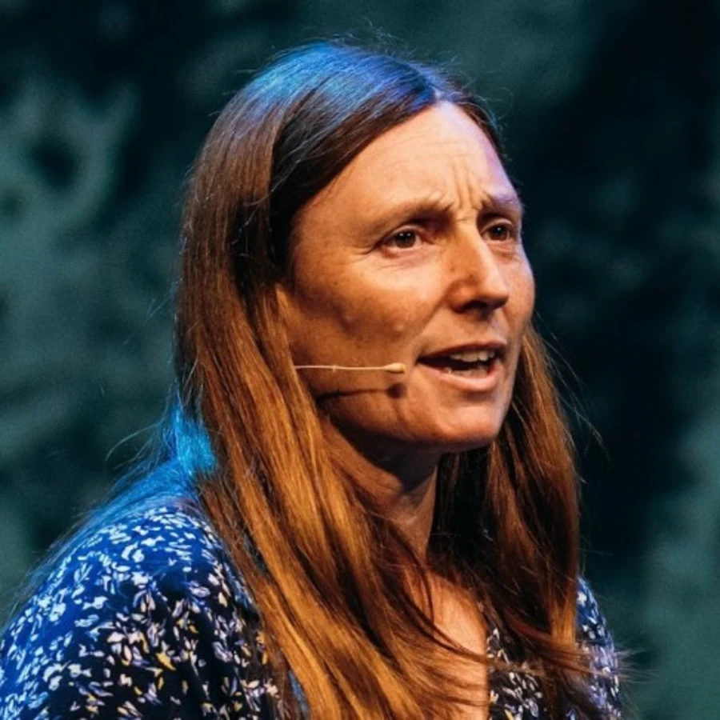

  

    
Hi, I’m

    

      Debbie O’Brien
    

    

      Platform Engineer, 
      Applied AI @ Zephyr Cloud
    

    

      I work on practical AI workflows for real product work — docs, testing, verification, and developer experience.
    

  

  

    
  

<!--
PRESENTER NOTES — INTRO
- Keep it brief. This is not the full bio slide; that remains at the end.
- Say who you are and what lens you're bringing to the talk.
- The photo gives the slide a more human feel without turning it into a bio dump.
-->
