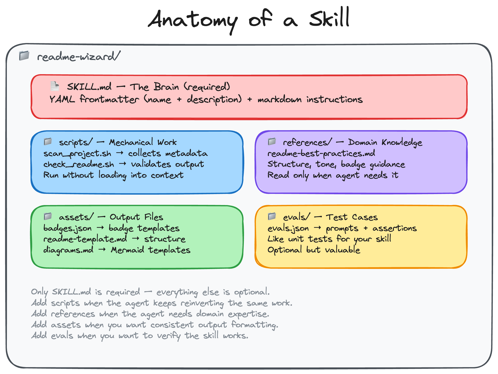

<h2 style="margin-bottom:22px">Anatomy of a skill</h2>

<!--
PRESENTER NOTES — SKILL ANATOMY VISUAL
- Let this breathe. Don't overload it with text.
- Point out three things: front-matter description, markdown instructions, reference files.
- This is from your beginner guide on agent skills.
-->
