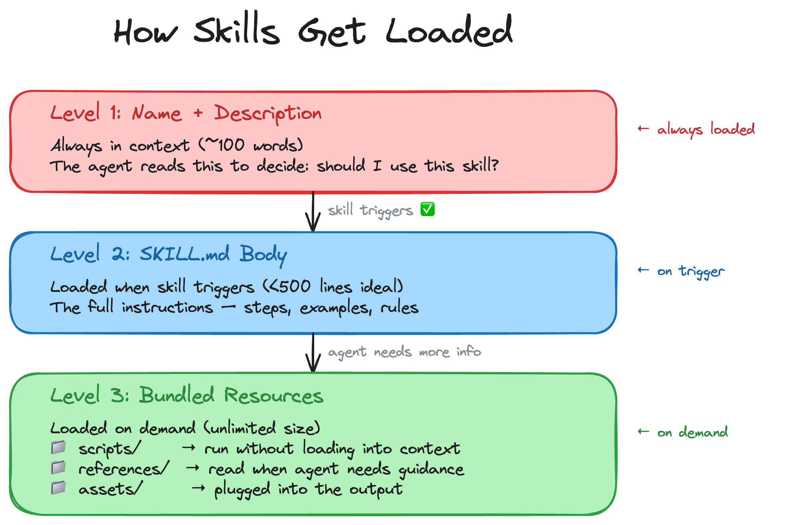

<h2>How skills get loaded</h2>

The agent does not read every skill all the time. It discovers, triggers, then loads details only when needed.

  

    
  

  

    

      1 · Discover
      
The agent sees the skill name and description.

    

    

      2 · Trigger
      
If the user request matches, the skill body loads.

    

    

      3 · Expand
      
Reference files and tools load only when the workflow needs them.

    

  

<!--
PRESENTER NOTES — HOW SKILLS LOAD
- This helps people who are new to skills understand why they are not just giant prompts.
- Use the visual from the beginner guide, then summarise with discover -> trigger -> expand.
- Bridge: "Now let's look at the smallest possible skill."
-->
