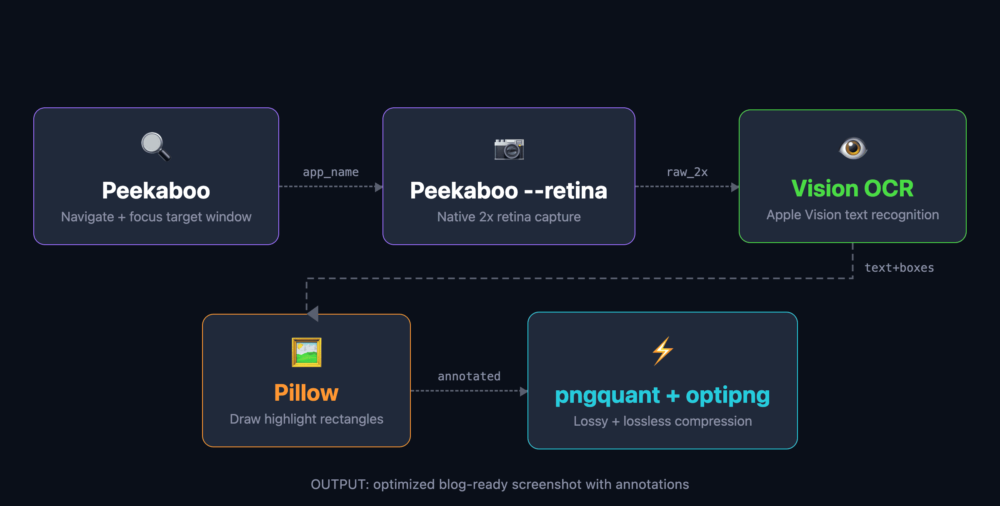

<h2 style="margin-bottom:20px">The docs pipeline</h2>

<!--
PRESENTER NOTES — DOCS PIPELINE VISUAL
- Use this as the visual overview before explaining the three skills.
- Keep it short: "this is the loop we built for docs".
- The important idea: documentation becomes a pipeline with evidence and preview, not just text generation.
-->
