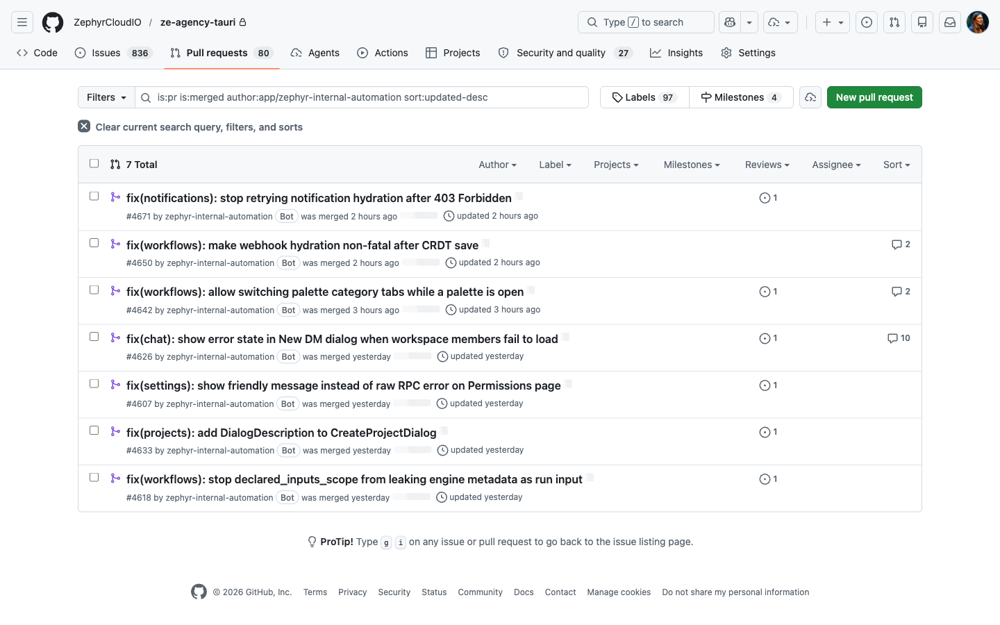

<h2>The receipts</h2>

Real PRs. Merged. Last 48 hours. Author: a scheduled agent.

  Found a bug. Reproduced it on the running app. Wrote the fix. Opened the PR. While I slept.

<!--
PRESENTER NOTES — RECEIPTS
- This is the moment that earns audience trust. They can verify on their phones.
- "Last 48 hours" is the unfakeable part. Say the date out loud.
- Then say: "let me walk you through one of these. Live."
- FALLBACK: if wifi dies, advance to the PR #4607 screenshot slide. Don't apologise.
-->
