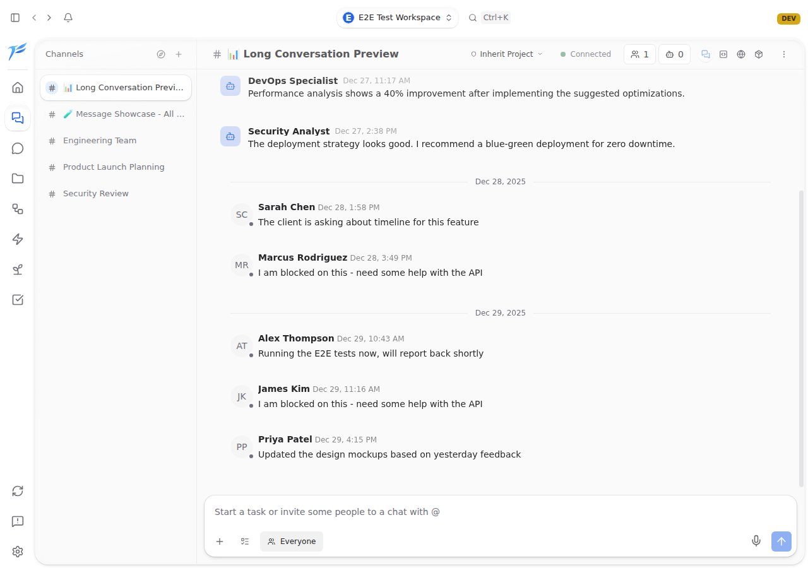
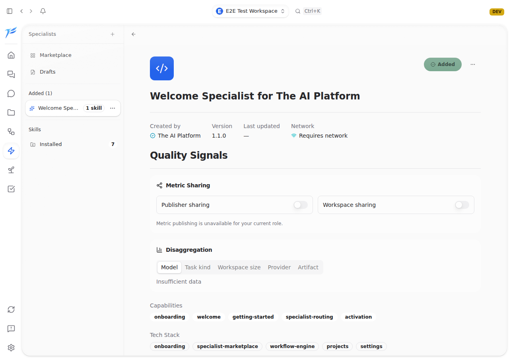
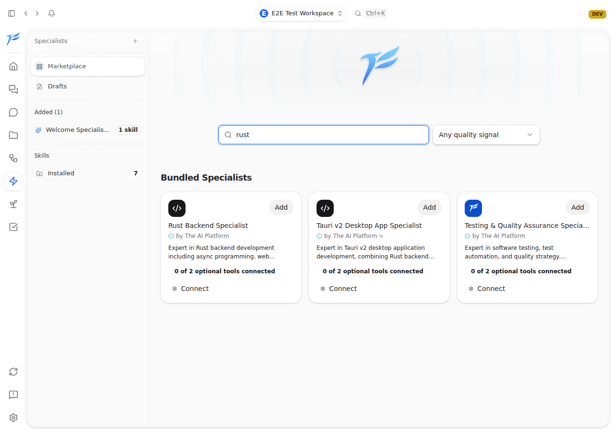
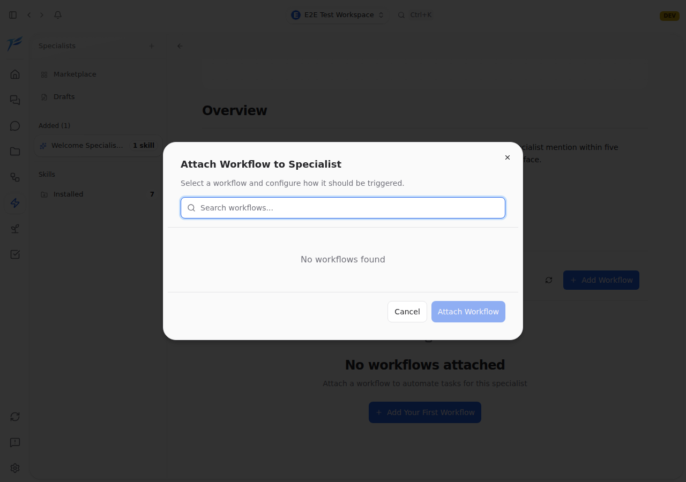
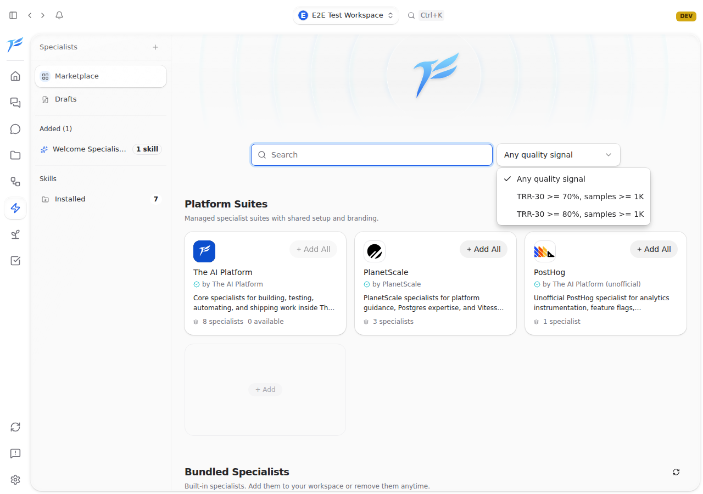
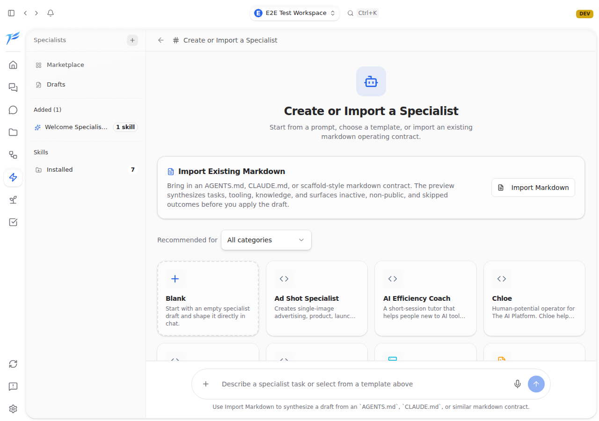

<h2>What the agent saw</h2>

One bug-hunt run. The agent driving the real desktop app, clicking like a tired QA tester.

  
  
  
  
  
  

  Bottom-right is the bug it filed: workflow shows up twice. Issue opened with repro steps and a screenshot. While I was asleep.

<!--
PRESENTER NOTES — AGENT EYE VIEW
- The "wait, it's actually using the app?!" slide.
- Pause on it. Let people look.
- Bottom-right tile is the bug. Point at it.
- These are CI artifacts from one hourly run.
-->
