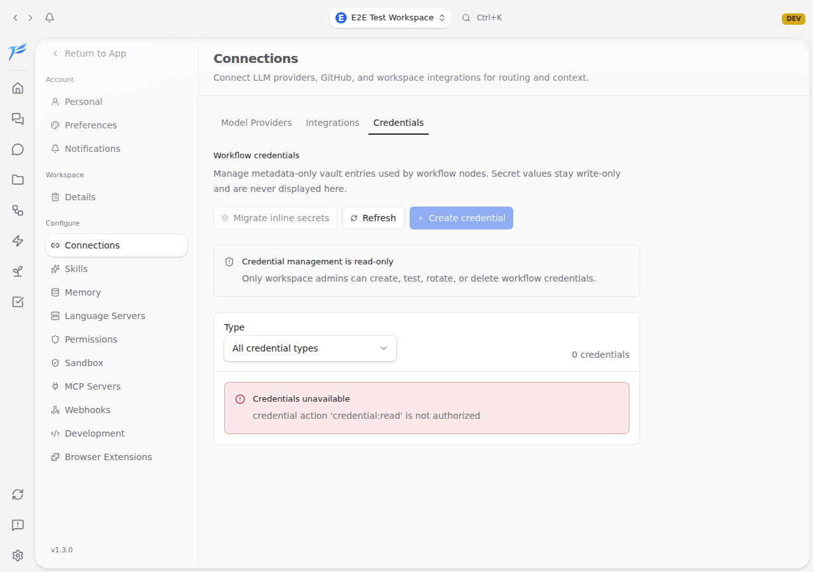
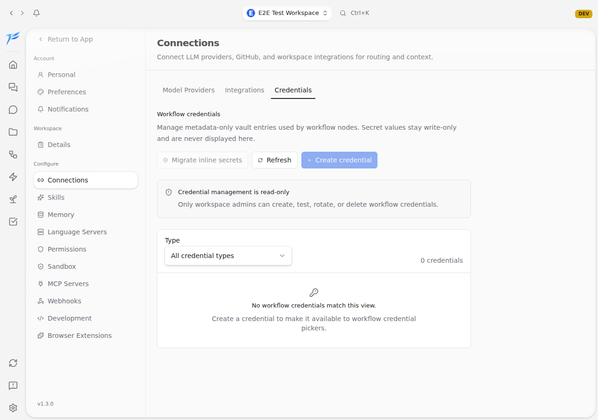

<h2>Example: PR #4868</h2>

A non-admin user opened Settings → Connections → Credentials and saw a raw Cerbos authorization error. The agent fixed the UI and attached before/after evidence.

  

    
Before — raw policy error leaked to the UI

    
  

  

    
After — read-only state, no raw policy string

    
  

  This is the kind of PR I want from an agent: what was wrong, what changed, and visual proof.

<!--
PRESENTER NOTES — PR 4868 EXAMPLE
- This is the concrete example PR for the bugfix workflow.
- Before: raw Cerbos auth error visible alongside the friendly notice.
- After: only the read-only credentials state remains; no internal policy string is shown.
- The important part is the evidence: before/after screenshots in the PR body.
- Next slide explains how those screenshots get from CI to public image URLs that Claude Code can insert.
-->
