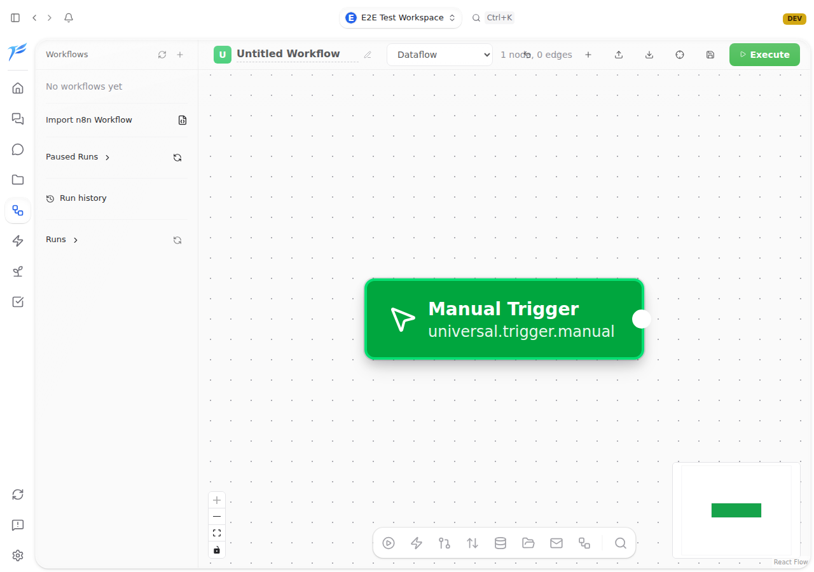
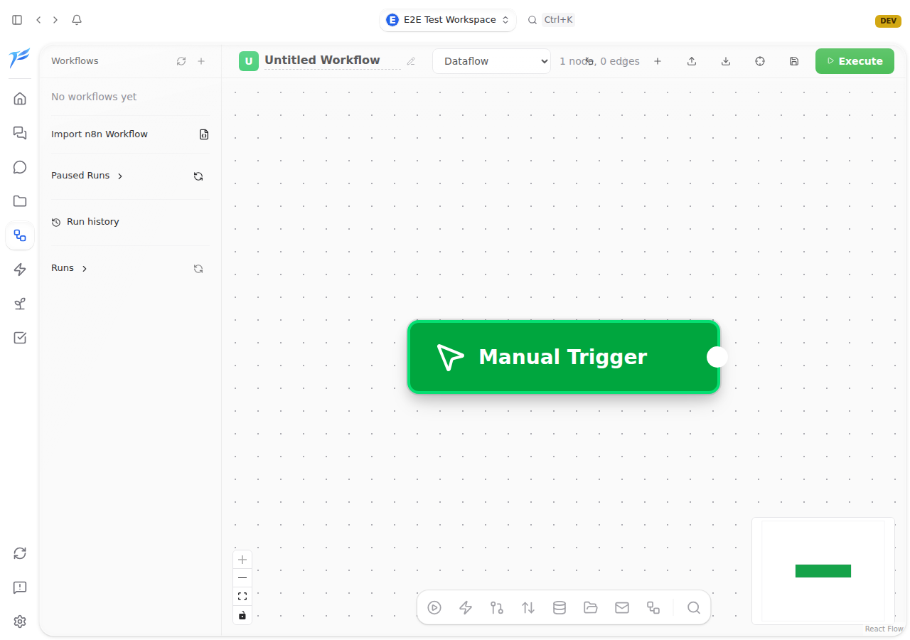

<h2>So we improved the loop</h2>

PR #4746 changed the workflow itself: run the bugfix agent against tauri dev, not a pre-built binary.

  

    Before
    <h3>Pre-built binary</h3>
    
No HMR. After-fix CDP verification could be blocked.

  

  

    Now
    <h3>tauri dev in CI</h3>
    
HMR + CDP reload. The agent can verify frontend fixes live.

  

  

    
Before — internal ID leaked

    
  

  

    
After — verified through HMR/CDP

    
  

<!--
PRESENTER NOTES — LOOP IMPROVED
- This is the maturity story.
- The system found a weakness in the verification environment, so we improved the environment.
- PR #4746 changed the workflow to use tauri dev in CI.
- PR #4735 shows the payoff: before/after screenshots in the PR body, verified live through HMR/CDP.
- Key line: "Don't only ask whether the agent did the task. Ask whether the loop gave it enough environment to verify the task."
-->
