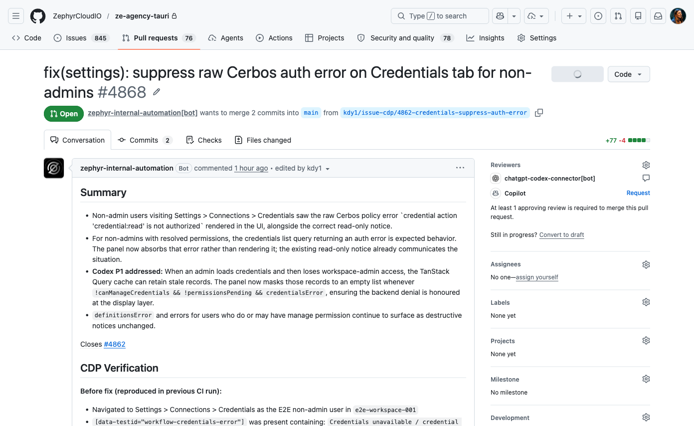

<h2>First: the issue context</h2>

PR #4868 starts with a clear bug report: what the user saw, where it happened, and what needed to change.

  The text matters before the screenshots: context → change → evidence.

<!--
PRESENTER NOTES — PR 4868 CONTEXT
- This slide sets up the PR before showing the before/after screenshots.
- Point out that the agent does not just dump a diff; it describes the user-facing issue and the intended outcome.
- Transition: "Then the PR body includes the visual proof." 
-->
