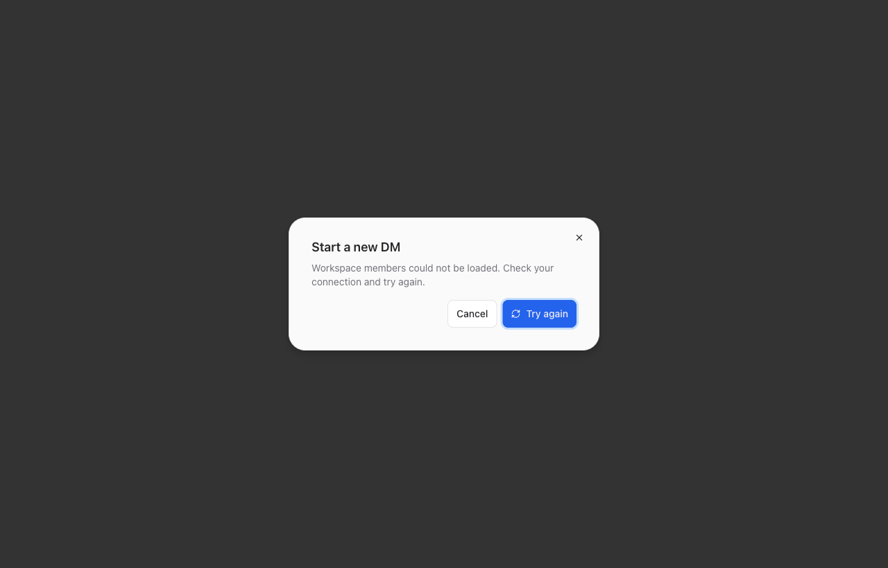
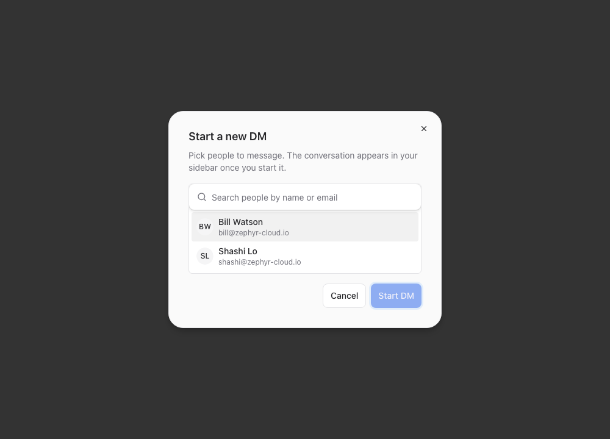

<h2>Then I verified it on a real running app</h2>

The screenshots I posted in the PR comment before approving. Both states.

  

    
❌ Members API failed — error state

    
  

  

    
✅ Try again clicked — recovered

    
  

  Agent shipped what it could prove. I shipped what it couldn’t. Both layers visible in one PR.

<!--
PRESENTER NOTES — HUMAN VERIFIED
- This is YOUR contribution. Own it on stage.
- Land "both layers visible in one PR".
- Bridge: "what does this pattern look like outside Tauri-CDP land?"
-->
