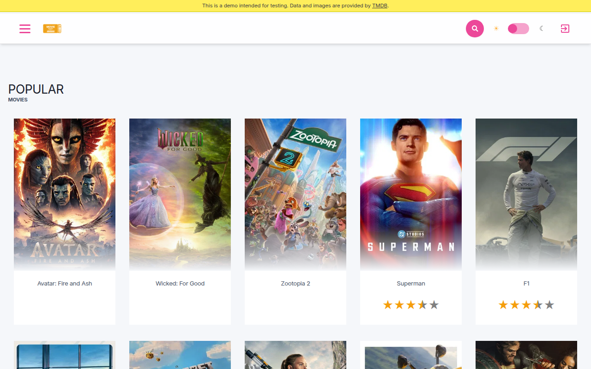

Hunt · skills PR #89 · production target

<!--
PRESENTER NOTES: HUNT HOME (~25s)
- Live: https://debs-obrien.github.io/playwright-movies-app/
- Skills landed via PR #89: site-bug-hunt + site-bugfix
- Interactive production hunt. Candidates only. No issue spam.
-->
