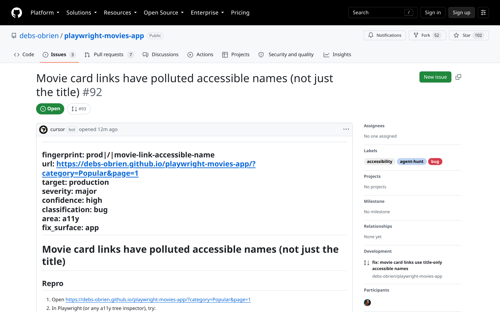

Issue #92 · gates passed · filed

<!--
PRESENTER NOTES: ISSUE (~20s)
- https://github.com/debs-obrien/playwright-movies-app/issues/92
- Labels: accessibility, agent-hunt, bug. Linked draft fix #93.
-->
