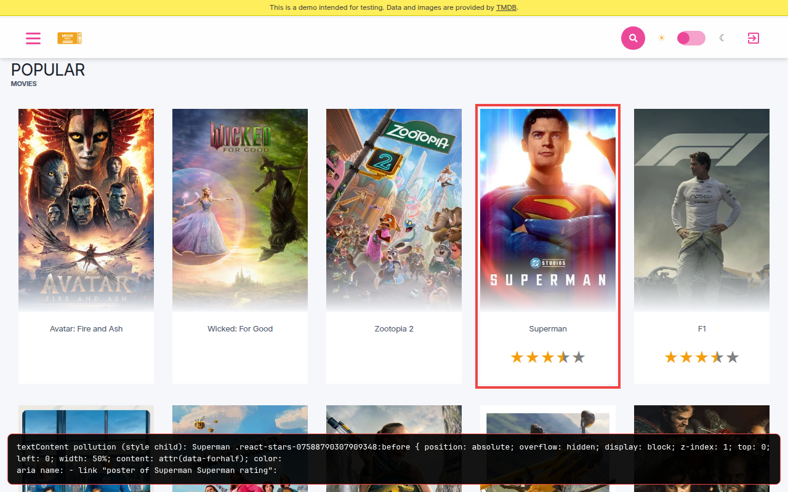

BEFORE · aria name pollution · Superman

<!--
PRESENTER NOTES: BEFORE (~30s)
- One-liner: announces "poster of Superman Superman rating" (sometimes CSS soup) instead of just the title.
- Mobile twin also in bag: before-movie-link-a11y-mobile.png. Skip unless you have time.
-->
