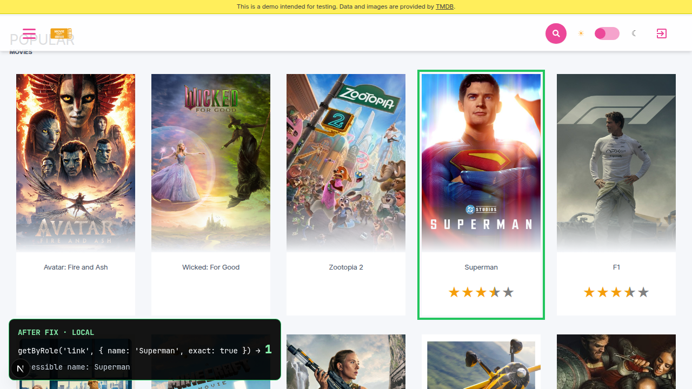

AFTER · local PR #93 preview · exact → 1

<!--
PRESENTER NOTES: AFTER (~25s)
- LOCAL / PR #93 worktree proof. Not live GH Pages.
- Live production still shows the before until Debbie merges #93.
- CLI: getByRole link exact Superman → 1. Accessible name: Superman.
-->
