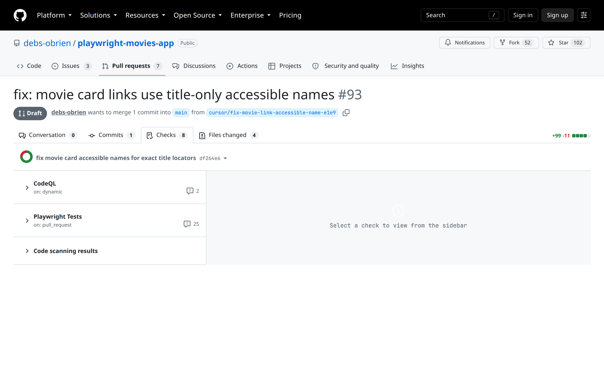

Human gate · Draft + Checks · you still merge

<!--
PRESENTER NOTES: HUMAN MERGE (~20s)
- Draft on purpose. Agent prepared the PR. Debbie merges (or doesn't).
- Alt shot available: 10b-draft-wip-merge-box.png. One beat only.
-->
