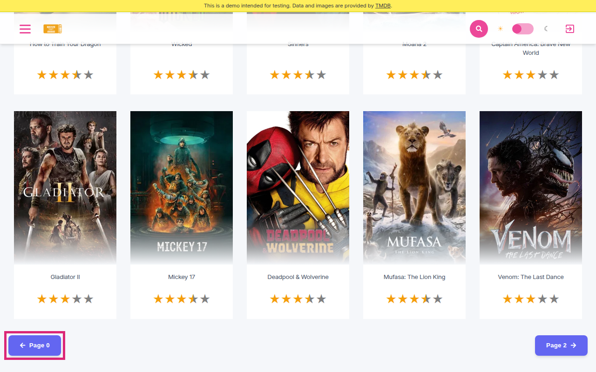

Also in the hunt · Alt find · ?page=0

<!--
PRESENTER NOTES: ALT FIND page=0 (~15s, skip if running long)
- Secondary only. Spine stays Superman movie-link-accessible-name.
- /?category=Popular&page=0 → stuck title "Please wait a moment. Movies", empty main.
- Hidden prev on page 1 is labeled Page 0 (forced visible here). Deferred vs primary a11y story.
-->
