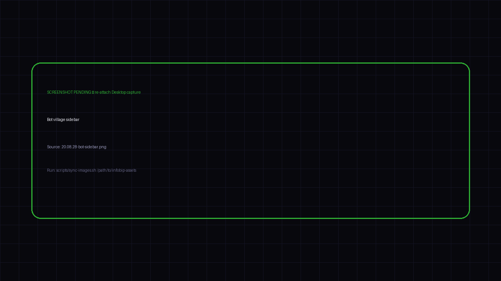

<h2 style="margin-bottom:10px">Bot village</h2>

Personal specialists · coach · travel · shopping · home

<!--
PRESENTER NOTES — SHOT: BOT VILLAGE · 4:45–5:45
- Full-bleed screenshot. Let the sidebar do the talking.
- Point at: chief of staff, coach bot, travel, shopping (Decathlon skill teaser), job hunt, home, blog.
- Say: each bot has a job. Noise stays out of the wrong channel.
- Timing: ~60s. Don’t narrate every row.
-->
