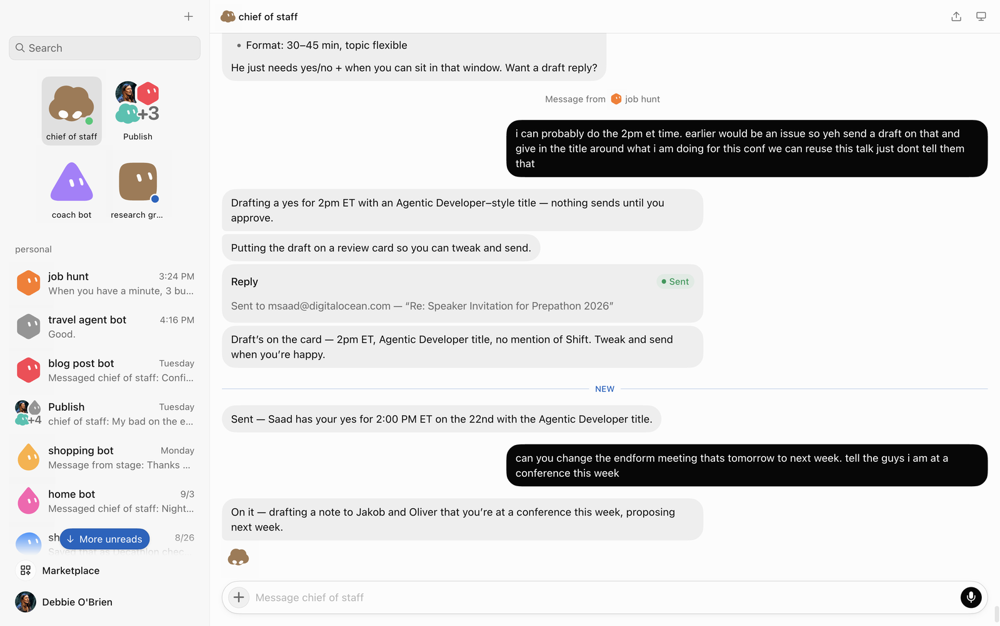

Grok Bot · what it can do

<!--
PRESENTER NOTES: GROK BOT COS
- Draft speaker reply from messy instruction. Review card. Nothing sends without my yes.
- Then reschedule endform. Same gate.
- Don't linger on the email in the UI. Point at the gate.
-->
