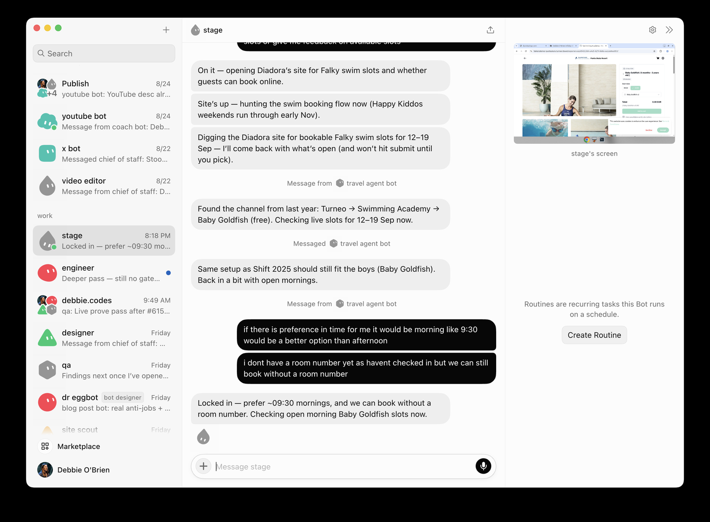

<h2 style="margin-bottom:10px">stage ↔ travel · live</h2>

Chat + live screen · prefer 09:30 · book without a room number

<!--
PRESENTER NOTES: SHOT: STAGE LIVE
- stage is talks. travel peeks Turneo for her.
- Async handoff. Not one mega-chat.
-->
