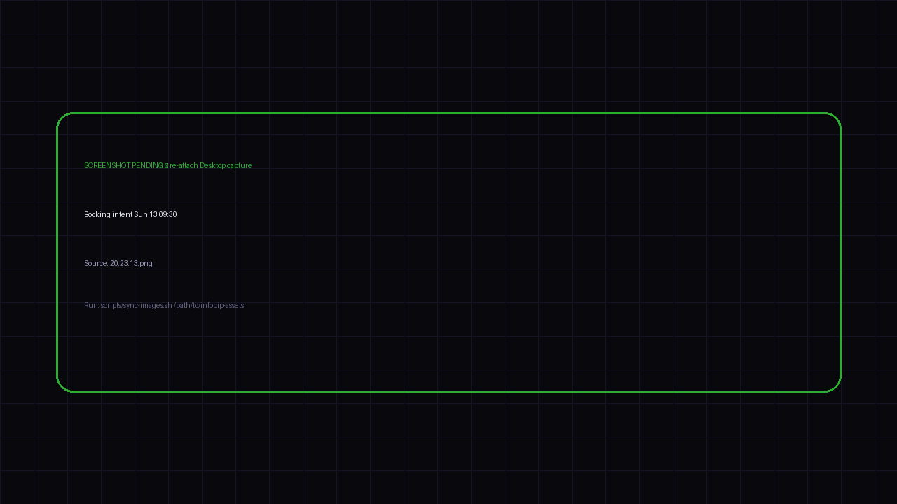

<h2 style="margin-bottom:10px">Booking intent</h2>

“lets do sun 13 9:30 and book it”

<!--
PRESENTER NOTES — SHOT: BOOKING INTENT · 11:00–11:45
- Clear yes from Debbie. Agent confirms Sun 13 09:30 for both boys.
- Free Turneo slot. Still no room number at this beat.
- Next: friction — checkout wants a room number anyway.
-->
