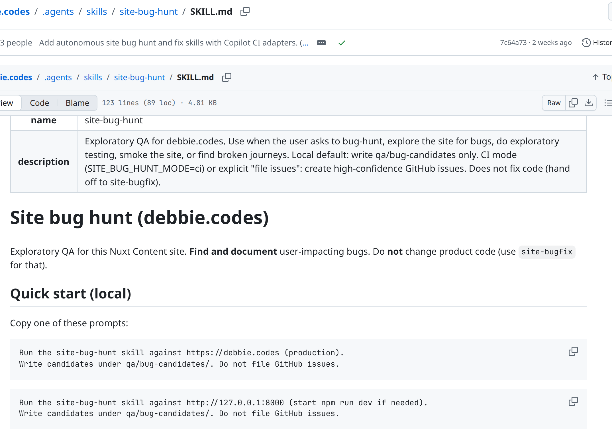

What&rsquo;s a skill? · site-bug-hunt/SKILL.md

<!--
PRESENTER NOTES: WHAT'S A SKILL (HUNT) (~30–45s)
- A skill is a real file in the repo. Not a vibes prompt in chat.
- Point at the path: .agents/skills/site-bug-hunt/SKILL.md
- Frontmatter name + description tell the agent when to pick it up.
- Punch: find and document. Do not change product code. Hand off to fix.
-->
