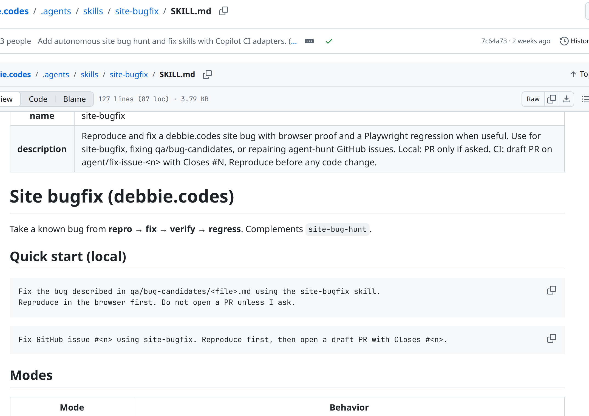

Fix skill · same shape, different job

<!--
PRESENTER NOTES: FIX SKILL FILE (~30s)
- Same SKILL.md pattern. Different job: repro → fix → verify → regress.
- Call out: reproduce before any code change. PR only if asked (local).
- Two skills keep the overnight loop honest. Hunt looks. Fix ships when proof holds.
-->
