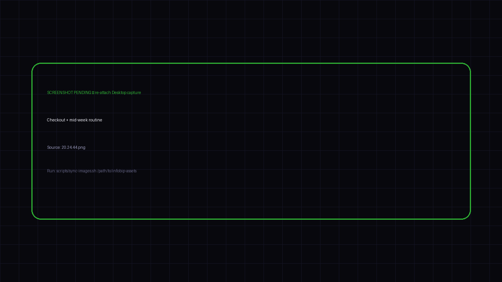

<h2 style="margin-bottom:10px">Checkout → routine</h2>

Booked · then watch mid-week mornings as they unlock

<!--
PRESENTER NOTES — SHOT: CHECKOUT + ROUTINE · 12:45–13:45
- “Going through Turneo checkout now” → confirmation ping.
- Created routine: Diadora mid-week Goldfish slots · weekday 9:00 checks.
- Agents don’t just finish tasks — they schedule the follow-up.
- Optional: Debbie also asks what other activities exist for the stay.
-->
