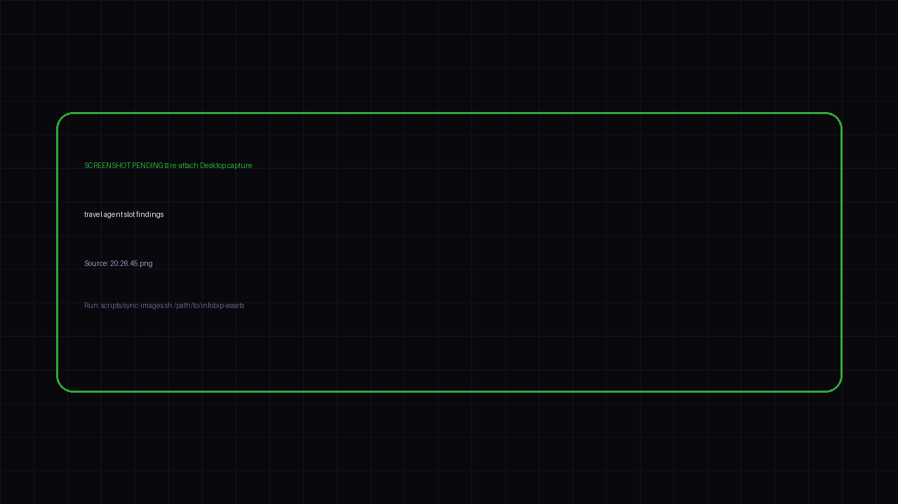

<h2 style="margin-bottom:10px">travel agent · findings</h2>

Free slots reported with live Turneo screenshots · no double-book

<!--
PRESENTER NOTES — SHOT: TRAVEL FINDINGS · 14:30–15:15
- travel corrects hotel context (Diadora / Punta Skala) and peeks live Turneo.
- Embeds screenshots as evidence — same receipt culture as PR screenshots.
- Scouts other activities for research only — won’t double-book Sun 13 Goldfish.
- Close the swim arc here; transition to work village.
-->
