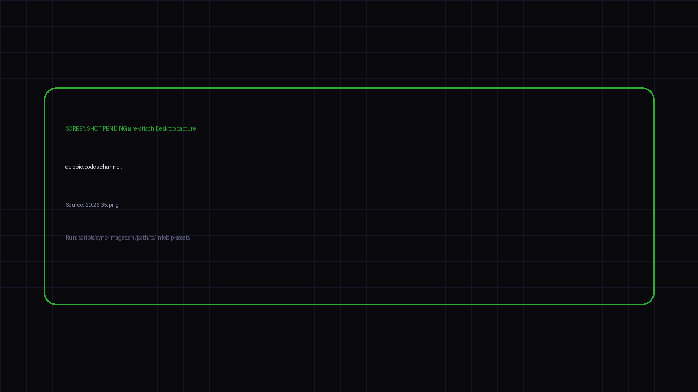

<h2 style="margin-bottom:10px">debbie.codes channel</h2>

engineer ↔ qa · merged PRs · selective CI proposal

<!--
PRESENTER NOTES — SHOT: DEBBIE.CODES · 16:20–16:50
- Roles already covered — use this shot as proof the channel is real.
- Point at engineer ↔ qa selective CI thread: bots debating like a team.
- Hygiene visible in practice: one owner speaking at a time.
-->
