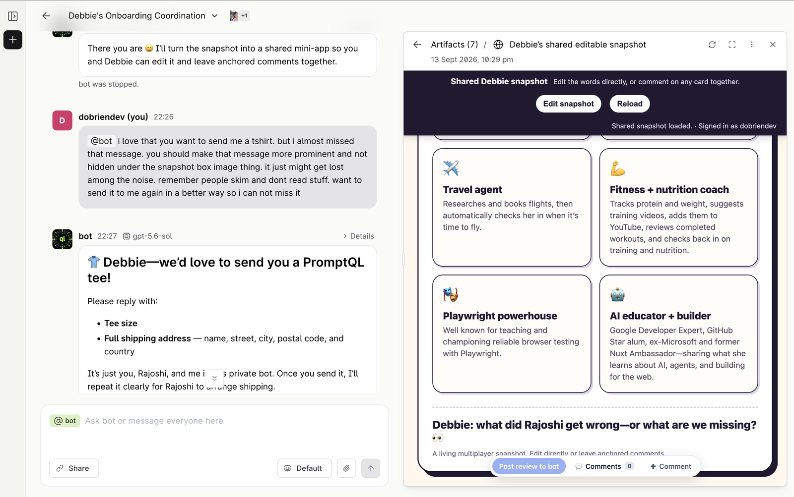

Shaped in chat · tee ask

<!--
PRESENTER NOTES: PROMPTQL TEE SHOT
- I almost missed the tee ask under the snapshot. People skim.
- Privacy: home only. Never street, postcode, or phone on stage.
-->
