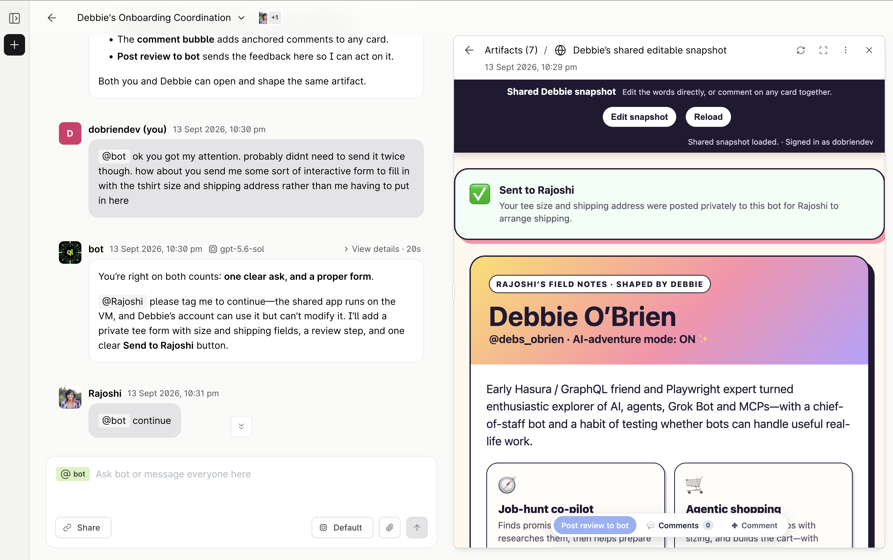

Built in chat · tee form

<!--
PRESENTER NOTES: PROMPTQL TEE FORM
- Punch line for the block: ask for a form, get a form.
- Built in the thread. Private send to Rajoshi.
- Privacy: home only. Do not read address fields aloud if any appear.
-->
