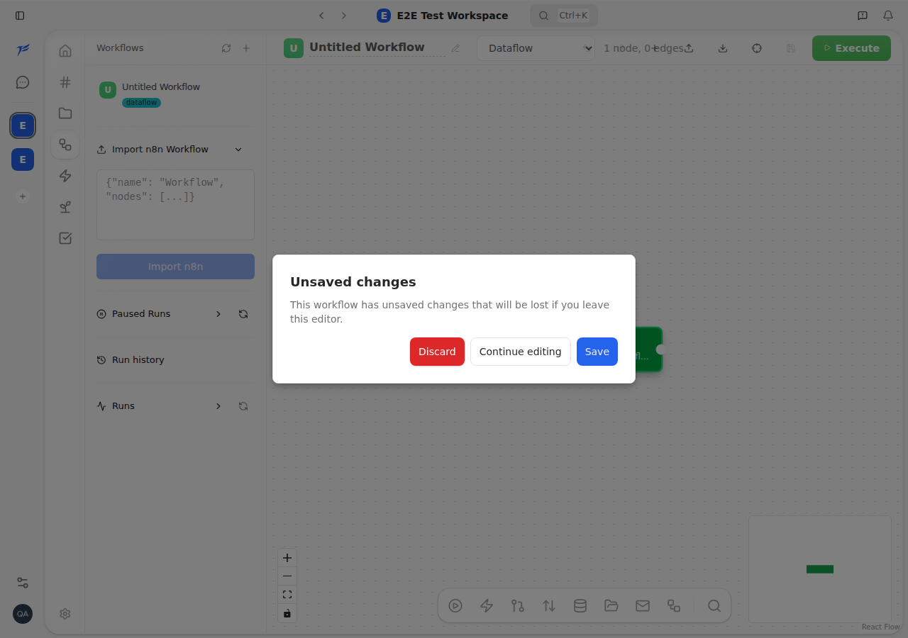
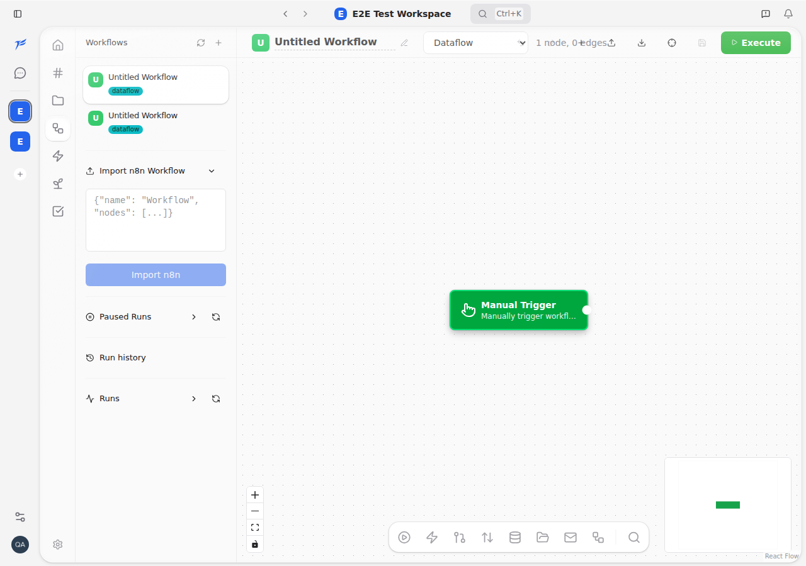

<h2>PR #5540: here's the proof</h2>

Real screenshots the agent took over CDP. Left: the bug. Right: the fix.

  

    
BEFORE: dialog pops up after a clean save

    
  

  

    
AFTER: saves quietly, no dialog

    
  

  And it checked the flip side too: a real unsaved change still warns you. It only stopped the false alarm.

<!--
PRESENTER NOTES, BEFORE/AFTER
- These are the genuine PNGs from PR #5540's CDP Verification section. Not mockups.
- Left: after clicking Save, the workflow IS saved (sidebar row, Save disabled) but the "Unsaved changes" dialog wrongly appears.
- Right: same flow, fix applied, dialog gone, URL updated to /workflows/wf_<id>.
- The regression guard line matters: it proves the agent didn't just suppress the dialog everywhere, the legitimate guard still fires. That's the difference between a fix and papering over.
- Root cause (if asked): useBlocker read a stale render-closure snapshot of hasUnsavedChanges; fix reads the live store via getState().
-->
