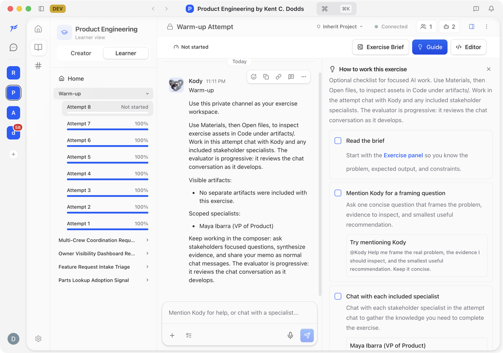

One more thing
<h2>Testing an AI product without burning the bill</h2>

This is Kent C. Dodds' Product Engineering Workshop. Learners chat with AI specialists, and a hidden AI evaluator scores their work.

  

    
  

  

    

      <h3 style="font-size:23px">💸 The catch</h3>
      
Every message is a real model call. A full test run means orchestration, specialist replies, and the evaluator, over and over.

    

    

      <h3 style="font-size:23px">🎯 The goal</h3>
      
Test the whole chat flow, end to end, and spend zero provider credit doing it.

    

  

<!--
PRESENTER NOTES, COURSE STUDIO PROBLEM
- Quick context: this is a real product we shipped, Kent C. Dodds' workshop. It teaches product engineering by having you actually chat with AI stakeholders.
- The point of tension: it's an AI product, so every end-to-end test would call real models. Orchestration decides who answers, specialists answer, and a hidden evaluator grades you against a rubric. That is a lot of paid tokens per run.
- Set up the question: how do you test all of that, honestly, without paying for it every time.
-->
