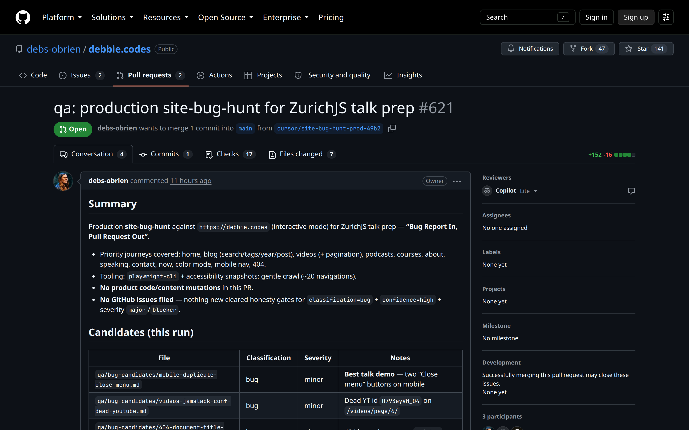

Hunt PR · production site-bug-hunt

<!--
PRESENTER NOTES: HUNT PR IMAGE (~25s)
- Point at the candidates table. Mobile duplicate Close is the talk demo.
- Call out: no GitHub issues filed. Honesty gates held.
-->
