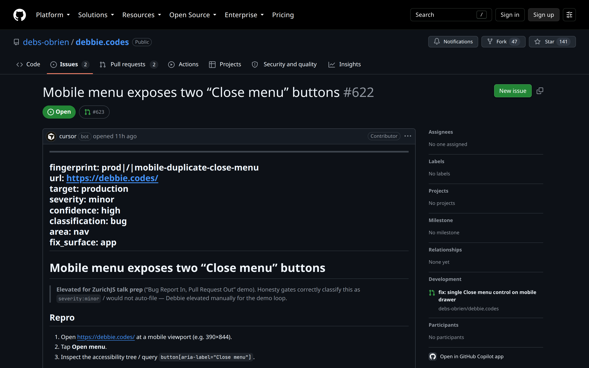

Issue · #622 · elevated for ZurichJS

<!--
PRESENTER NOTES — ISSUE IMAGE (≈20s)
- Cursor bot authored. Linked to fix PR #623 in the sidebar.
- Read the callout: gates would not auto-file; Debbie elevated.
-->
