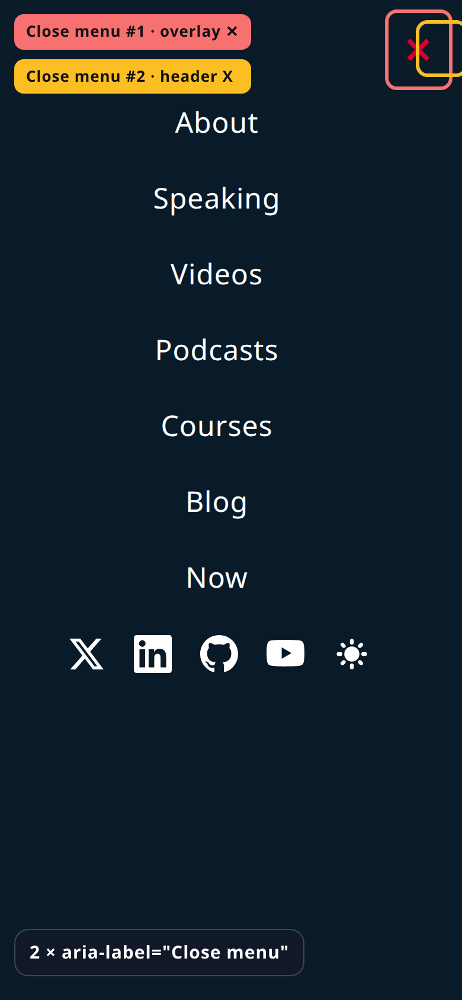

BEFORE · prod repro · 2 × Close menu

<!--
PRESENTER NOTES — BEFORE IMAGE (≈30s)
- Production, 390×844. Overlay ✕ + header X both aria-label Close menu.
- Screen-reader hears two dismiss controls. Visual highlights both.
-->
