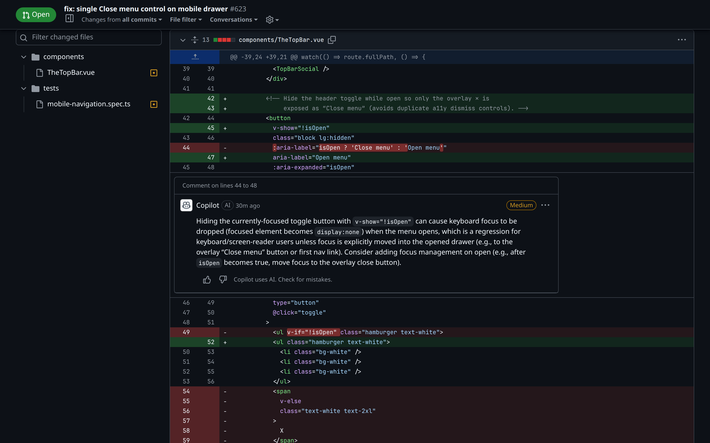

Files changed · TheTopBar.vue

<!--
PRESENTER NOTES — THETOPBAR DIFF (≈30s)
- One-file fix: v-show="!isOpen" on header toggle; aria-label stays Open menu.
- Copilot review comment is fine to mention: humans still read AI review.
-->
