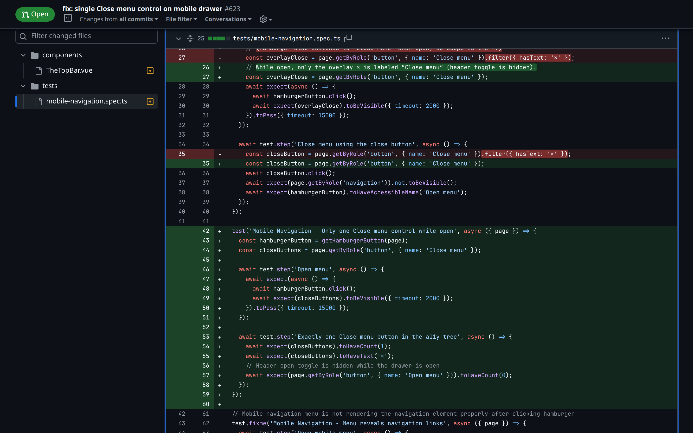

Regression · mobile-navigation.spec.ts

<!--
PRESENTER NOTES — PLAYWRIGHT TEST (≈30s)
- Highlight toHaveCount(1). Old filter({ hasText: ✕ }) gone — bug forced the filter.
- Loop leaves a test so the bug can't quietly return.
-->
