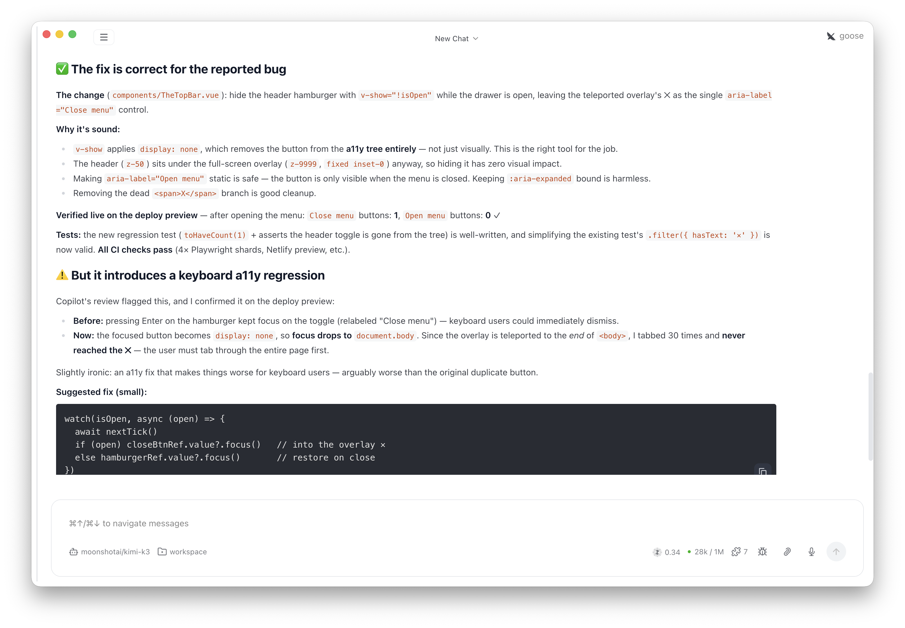

Human review · a11y

<!--
PRESENTER NOTES: REVIEW A11Y (~25s)
- Agents prepared the PR. Green CI. Still not done.
- Point at the warning: focus drops to body. Tab thirty times. Never hits the X.
- That's why you still merge. Second eyes catch what the first pass shipped.
-->
