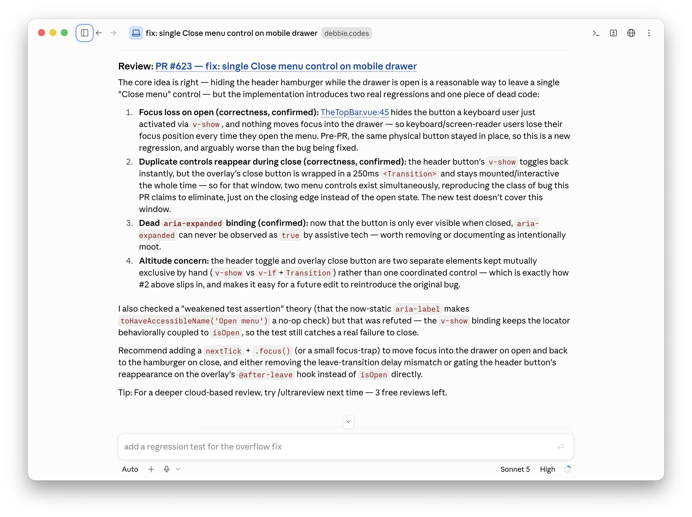

Review · PR fix still needs eyes

<!--
PRESENTER NOTES: ULTRAREVIEW (~25s)
- Same PR, deeper pass. Focus loss, close-transition double controls, dead aria-expanded.
- Agents write the PR. You (or a second review) still decide merge.
- Then cut to takeaways.
-->
